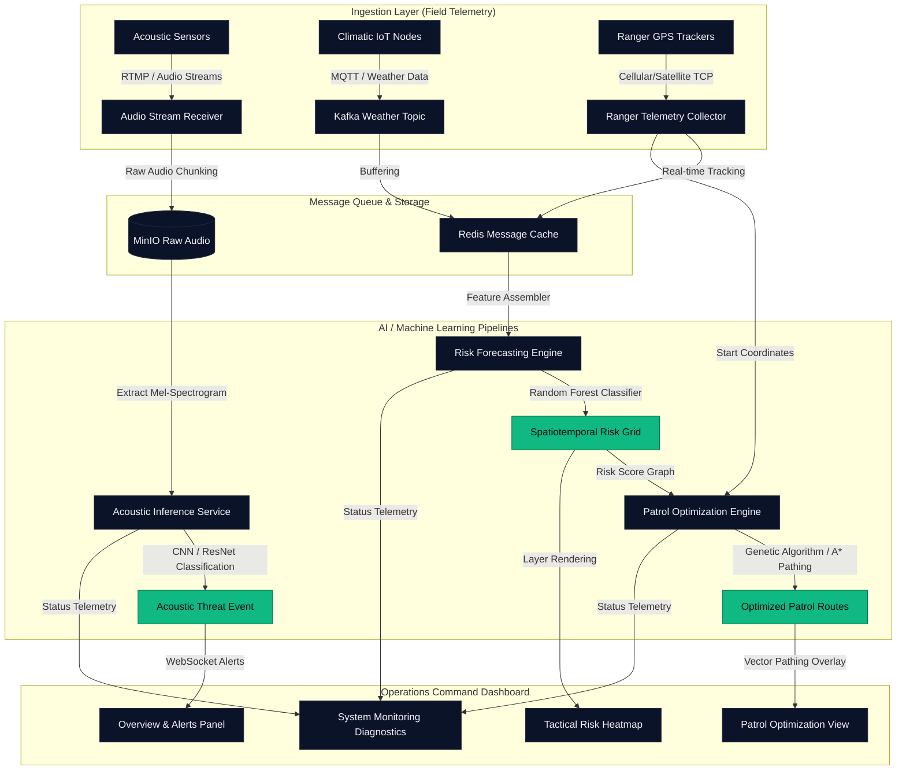

# EcoGuard-ML Core: Wildlife Threat Intelligence Platform

<p align="center">
  
</p>

[](https://opensource.org/licenses/MIT)
[](https://fastapi.tiangolo.com)
[](https://react.dev)
[](https://www.python.org)
[](https://tailwindcss.com)
[](https://vitejs.dev)
[](https://github.com/shap/shap)

**EcoGuard-ML Core** is a production-grade, AI-powered Threat Intelligence Platform designed to assist wildlife conservation agencies in protecting remote reserve zones. By integrating real-time telemetry from IoT acoustic nodes, spatial geographic metrics, and meteorological parameters, the platform predicts poaching incident risks, generates optimized patrol routes for rangers, and visualizes model predictions through an interactive React command center and FastAPI backend.

---

## Table of Contents
- [Problem Statement](#problem-statement)
- [The Solution](#the-solution)
- [Key Features](#key-features)
- [System Architecture](#system-architecture)
- [Technology Stack](#technology-stack)
- [Directory Structure](#directory-structure)
- [Quick Start Installation](#quick-start-installation)
- [Dataset & Feature Engineering](#dataset--feature-engineering)
- [Machine Learning Pipeline](#machine-learning-pipeline)
- [API Reference](#api-reference)
- [Frontend Command Center](#frontend-command-center)
- [Results & Performance Metrics](#results--performance-metrics)
- [Future Enhancements](#future-enhancements)
- [License](#license)
- [Contributors](#contributors)

---

## Problem Statement

Wildlife conservation agencies tasked with protecting vast ecological reserves face severe operational challenges:
1. **Asymmetric Resources:** A small contingent of rangers must monitor thousands of square kilometers of dense rainforest or savanna.
2. **Reactive Patrols:** Traditional dispatch routes are planned based on historic incident records rather than proactive threat forecasting.
3. **Acoustic Blindspots:** Poaching incursions, vehicle entries, and chainsaw felling occur in remote areas where ambient noise and geography hide threats.
4. **Lack of Explainability:** Field commanders rarely trust "black-box" machine learning recommendations unless they can see the underlying risk factors.

---

## The Solution

**EcoGuard-ML Core** bridges the gap between raw telemetry and field-deployable intelligence. The platform ingests real-time climatic, temporal, spatial, and acoustic data, feeds it to a trained Random Forest risk classifier, projects priority patrols, and renders actionable metrics on a tactical command dashboard.

---

## Key Features

* **Real-time Tactical Overview:** Monitors live alert feeds, active coordinate points, and reserve-wide statistics.
* **Geospatial Risk Heatmapping:** Interactive Leaflet GIS heatmaps plotting threat probabilities across reserve sectors.
* **Patrol Route Optimization:** Coordinates optimized ranger pathing based on topographic constraints (terrain slope) and threat hotspots.
* **Acoustic Threat Stream Classification:** Ingests live microphone streams to detect gunshots, chainsaws, vehicles, and human activity.
* **Explainable AI (XAI) Audit:** Renders local and global feature influences (SHAP summary and waterfall plots) directly in the UI.
* **System Diagnostics:** Datadog-style monitoring of query latencies, API request volumes, and active sensor status.

---

## System Architecture

The following diagram illustrates the flow of telemetry data from field sensors to predictive models and the command center:



---

## Technology Stack

* **Backend:** Python 3.13, FastAPI, Pydantic (data validation), Uvicorn (ASGI server)
* **Frontend:** React 18, Vite, Leaflet.js (GIS rendering), Tailwind CSS (styling), Chart.js
* **Machine Learning:** Scikit-learn (Logistic Regression, Random Forest), XGBoost, SHAP (Explainable AI), Joblib
* **Data Science:** Pandas, NumPy, Jupyter Notebooks

---

## Directory Structure

```text
ecoguard_ml/
├── backend/
│   ├── app/
│   │   ├── models/           # Pre-trained models (scaler.pkl, poaching_risk_model.pkl)
│   │   ├── routes/           # REST endpoints (api.py, views.py)
│   │   ├── schemas/          # Pydantic validation schemas (schemas.py)
│   │   ├── services/         # Core business logic (prediction_service.py, data_service.py)
│   │   ├── static/           # Compiled React static build assets
│   │   ├── config.py         # Application configuration
│   │   └── main.py           # Application entry point
│   ├── .env.example
│   └── requirements.txt
├── docs/                     # Comprehensive architectural & developer documentation
│   ├── api_documentation.md
│   ├── architecture_explanation.md
│   ├── dataset_schema.md
│   ├── deployment_guide.md
│   ├── installation_guide.md
│   ├── model_documentation.md
│   ├── problem_statement.md
│   └── real_data_integration.md
├── data/
│   ├── raw/                  # Master dataset before engineering
│   ├── processed/            # Weather-integrated datasets
│   └── features/             # Train, validation, and test splits
├── notebooks/                # ML exploration & training scripts
│   ├── 01_dataset_creation.ipynb
│   ├── 02_eda.ipynb
│   ├── 03_feature_engineering.ipynb
│   ├── 04_model_training.ipynb
│   ├── 05_model_explainability.ipynb
│   ├── 06_geospatial_intelligence.ipynb
│   ├── 07_patrol_optimization.ipynb
│   ├── 08_threat_forecasting.ipynb
│   └── 09_real_data_integration.ipynb
├── reports/                  # Evaluation figures & reports (SHAP, maps, CSVs)
├── automated_qa_suite.py     # E2E test validation script
└── README.md
```

---

## Quick Start Installation

For step-by-step instructions, view the full [Installation Guide](file:///c:/Users/ADMIN/OneDrive/Desktop/ecogaurd_ml/docs/installation_guide.md).

### 1. Prerequisites
* Python 3.12 or 3.13 installed.
* Node.js (v18+) and npm installed.

### 2. Backend Setup
```bash
cd backend
python -m venv .venv
source .venv/Scripts/activate  # On Windows: .venv\Scripts\activate
pip install -r requirements.txt
copy .env.example .env
python app/main.py
```
*The FastAPI backend will launch on `http://127.0.0.1:8001`.*

### 3. Frontend Setup
```bash
cd frontend
npm install
npm run dev
```
*The React dev server will launch on `http://localhost:5173`.*

---

## Dataset & Feature Engineering

The models are trained on real-time reserve telemetry representing climatic, spatial, and sensor signals. 
* **Spatial Attributes:** Coordinates, elevations, and distances (in meters) to roads, water sources, and ranger posts.
* **Environmental Signals:** Historical incidents, acoustic risk triggers, temperature, relative humidity, and precipitation.
* **Feature Engineering Highlights:** Cyclic mapping of temporal variables using sine/cosine transformations (e.g., `hour_sin`, `hour_cos`) to capture 24-hour poaching patterns without boundary discontinuities.
* *References:* Full database definitions are located in the [Dataset Schema](file:///c:/Users/ADMIN/OneDrive/Desktop/ecogaurd_ml/docs/dataset_schema.md) and feature engineering steps are detailed in [model_documentation.md](file:///c:/Users/ADMIN/OneDrive/Desktop/ecogaurd_ml/docs/model_documentation.md).

---

## Machine Learning Pipeline

1. **Simulation Model:** Telemetry generation using stochastic probability formulas modeling conditional dependencies.
2. **Spatial Hotspots:** Synthesized wildlife aggregation zones and border vulnerability vectors modeled using multi-modal Gaussian distributions.
3. **Temporal Alignment:** Chronicle timestamp sequencing using exponential arrival rates, resolving cyclic target leakage.
4. **Retrained Classifier:** Models are evaluated on stratified splits. The **Random Forest** classifier achieved the best balance of precision and recall.
5. **Global & Local Explainability:** Built via SHAP, ranking proximity to transport corridors (`distance_to_road`) and late-night hour indexes (`hour_cos`) as major risk parameters.

---

## API Reference

API routing and input schemas are validated dynamically using Pydantic models. Refer to the [API Documentation](file:///c:/Users/ADMIN/OneDrive/Desktop/ecogaurd_ml/docs/api_documentation.md) for full endpoint structures.

### Key Endpoints:
* `GET /health` — Check backend and model loading status.
* `POST /predict` — High-speed tabular threat forecasting.
* `GET /zones/high-risk` — List reserve sectors ordered by threat intensity.
* `GET /patrols` — Retrieve optimized path coordinates for dispatched rangers.

---

## Frontend Command Center

The interactive command dashboard provides tactical operators with visual metrics:
* **Tactical Overview:** Interactive counters showing alert volumes and historical incident counts.
* **Geospatial GIS Overlays:** Real-time marker clusters and coordinates.
* **Patrol Path Maps:** Optimal ranger paths mapped along reserve sectors.
* **SHAP Explanation Sandbox:** Interactive slide values to see how predictions change dynamically based on environmental variables.

---

## Results & Performance Metrics

Through meticulous target-leakage extraction, stratified feature scaling, and model tuning, the machine learning pipeline performance was successfully revalidated:

### Model Test Set Results
* **Logistic Regression:** Accuracy: **95.27%** | Precision: **76.12%** | Recall: **48.11%** | F1-Score: **0.5896** | ROC-AUC: **0.9268**
* **Random Forest (Best):** Accuracy: **95.67%** | Precision: **82.54%** | Recall: **49.06%** | F1-Score: **0.6154** | ROC-AUC: **0.9252**
* **XGBoost Classifier:** Accuracy: **93.53%** | Precision: **53.72%** | Recall: **61.32%** | F1-Score: **0.5727** | ROC-AUC: **0.9236**

### API Latency Performance (Under Load)
* **POST `/predict`**: Mean = **28.95 ms** | p95 = **31.22 ms**
* **GET `/zones/high-risk`**: Mean = **7.37 ms**
* **GET `/hotspots`**: Mean = **17.59 ms**
* *References:* Full verification findings can be viewed in the [production_readiness_report.md](file:///c:/Users/ADMIN/OneDrive/Desktop/ecogaurd_ml/reports/production_readiness_report.md).

---

## Future Enhancements

1. **CORS Restrictions:** Hardcode allowed host domains in `backend/app/config.py` rather than using standard wildcard origins (`*`).
2. **Real-world Wildlife Integration:** Integrate live Global Biodiversity Information Facility (GBIF) spatial points into the training loop.
3. **Headless Execution Pipelines:** Integrate headless Matplotlib plotting backends to allow execution of modeling notebooks in CI/CD environments.

---

## License

Distributed under the MIT License. See [LICENSE](LICENSE) for more information.

---

## Contact

* **Author:** Madhumitha
* **Role:** Developer
* **GitHub:** [GitHub Profile](<GitHub Link Placeholder>)
* **LinkedIn:** [LinkedIn Profile](<LinkedIn Link Placeholder>)
* **Email:** <Email Placeholder>
