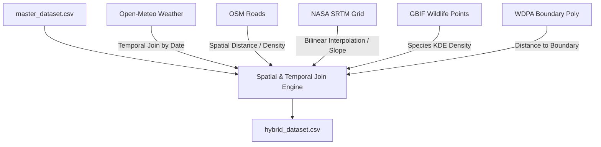

# Real-World Data Integration Layer: EcoGuard-ML Core

This document outlines the architecture, data sources, ingestion methods, feature mapping, and spatial-temporal merge strategies for integrating real-world environmental and geospatial datasets into the **EcoGuard-ML Core** platform.

---

## 1. Raw Data Sources & Ingestion Methods

### A. Open-Meteo Weather Data
*   **Source**: Open-Meteo Historical Weather API (`https://open-meteo.com/`).
*   **Method**: Ingested via HTTP GET requests using lat/lon boundaries and start/end dates.
*   **Resolution**: Daily summaries.
*   **Fields**: Maximum temperature at 2m, relative humidity, precipitation sum.

### B. OpenStreetMap (OSM) Roads
*   **Source**: Geofabrik Tanzanian OSM extract (`https://download.geofabrik.de/africa/tanzania.html`) or Overpass API.
*   **Method**: Downloaded as `.pbf` or `.geojson` and parsed using GeoPandas.
*   **Resolution**: LineString vectors.
*   **Fields**: Road lines representing access tracks, tertiary roads, and highways.

### C. NASA SRTM Elevation Data
*   **Source**: Shuttle Radar Topography Mission (SRTM) 30m digital elevation grid (`https://earthdata.nasa.gov/`).
*   **Method**: Downloaded as GeoTIFF files or structured CSV grid points.
*   **Resolution**: 30-meter spatial grids.
*   **Fields**: Elevation above sea level (meters).

### D. GBIF Wildlife Occurrences
*   **Source**: Global Biodiversity Information Facility (GBIF) Occurrences database (`https://www.gbif.org/`).
*   **Method**: Extracted via GBIF API queries filtered by geographic bounding box and primary wildlife species (Rhino, Elephant, Lion, Buffalo, Zebra).
*   **Resolution**: Sighting coordinates.
*   **Fields**: Occurrence coordinates, species tags, and sighting counts.

### E. WDPA Protected Areas
*   **Source**: World Database on Protected Areas (WDPA) Serengeti boundaries (`https://www.protectedplanet.net/`).
*   **Method**: Downloaded as shapefiles or GeoJSON polygons.
*   **Resolution**: Boundary polygon shapes.
*   **Fields**: Park boundaries and status categories.

---

## 2. Feature Mapping Schema

| Target Feature Name | Source Dataset | Source Field | Extraction Logic / Formula |
| :--- | :--- | :--- | :--- |
| **`real_temperature`** | Open-Meteo | `temperature_2m_max` | Daily maximum temperature on event date at coordinates. |
| **`real_rainfall`** | Open-Meteo | `precipitation_sum` | Total rainfall sum on event date at coordinates. |
| **`real_humidity`** | Open-Meteo | `relative_humidity_2m` | Average relative humidity percentage. |
| **`road_density`** | OpenStreetMap | LineString Geometry | Distance-weighted road density score within 5km. |
| **`terrain_slope`** | NASA SRTM | Elevation Grid | Numerical derivative (gradient) of elevation. |
| **`reserve_proximity`** | WDPA | Polygon Geometry | Shortest distance in meters to the nearest park border. |
| **`species_occurrence_density`** | GBIF | Point Coordinates | Gaussian KDE density of species sightings within 10km. |

---

## 3. Integration Merge Strategy

### Ingestion Steps:
1.  **Temporal Join**: Match daily temperature, rainfall, and humidity from Open-Meteo with the `date` of each master record.
2.  **Spatial Indexing**: Create standard spatial indices (R-Tree) using GeoPandas on OSM lines, WDPA boundaries, and GBIF points.
3.  **Road Density Computation**: Count the number of road intersections or compute path offsets within 5km.
4.  **Slope Extraction**: Calculate elevation difference between grid points to extract terrain slope gradients.
5.  **Park Boundary Distance**: Compute geodesic distances to the nearest border polygon point.
6.  **Species Density**: Perform a spatial query within 10km to count occurrence sightings for the event's detected species.
7.  **Data Alignment Check**: Assure that all 10,000 master logs retain their original threat indicators and classifications.
